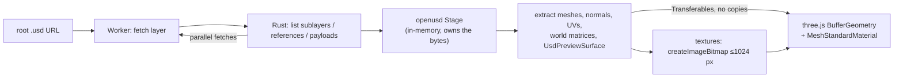

# usd-web-viewer

View OpenUSD files in the browser. Real USD composition (sublayers, references, payloads, variants) in a **594 KB** WASM module, rendered with three.js. MIT, no `SharedArrayBuffer`, no COOP/COEP headers, loads straight from Hugging Face Hub URLs.

| LG laptop | Robotiq gripper | Standard Bots arm | NVIDIA IV pole | NVIDIA chair | imagine.io railing |
|:-:|:-:|:-:|:-:|:-:|:-:|
|  |  |  |  |  |  |

## Quick start

```sh
npm install usd-web-viewer three   # not published to npm yet
```

Drop-in element (works as is in Vite and other bundlers; see [`examples/vite`](examples/vite)):

```html
<script type="module">import 'usd-web-viewer/element';</script>

<usd-viewer
  src="https://huggingface.co/datasets/Robotiq-Official/simready-assets/resolve/main/Robotiq_2F_85/simready_usd/Robotiq_2F_85.usda"
  alt="Robotiq 2F-85 gripper"></usd-viewer>
```

Attributes: `src`, `textures`, `max-texture-size`, `alt`. Events: `progress`, `load`, `error`.

Or drive it from JavaScript:

```js
import { createViewer } from 'usd-web-viewer';

const viewer = createViewer(document.getElementById('app'));
const { info, complete } = await viewer.load(url);
console.log(info.meshes, info.triangles); // geometry is on screen now
await complete;                           // textures streamed in
```

Bring your own three.js scene instead:

```js
import { loadUsd } from 'usd-web-viewer';

const { root, dispose } = await loadUsd(url);
scene.add(root);   // THREE.Group, Y-up, metres
```

| Option | Default | |
|---|---|---|
| `textures` | `'preview'` | `'none'`, `'preview'` (no normal maps, data maps at 512 px) or `'full'`. See [preview vs full](bench/results/README.md#texture-modes-preview-vs-full) |
| `maxTextureSize` | `1024` | Long-side cap for textures |
| `signal` | – | `AbortSignal` to cancel the load |
| `onProgress` | – | Called per stage: `layers`, `compose`, `geometry`, `textures` |
| `headers` / `fetch` | – | Auth for gated or private files outside huggingface.co |

Errors are `UsdLoadError`s with a `code`; anything that could not be shown faithfully is listed in `info.warnings`. Every option, error code and warning is typed in [`index.d.ts`](packages/viewer/src/index.d.ts).

## Compared with other browser USD viewers

Six real [SimReady](https://huggingface.co/datasets/cfahlgren1/simready-usd-web-viewers) packages from the Hub.

| | **usd-web-viewer** | [Needle](https://www.npmjs.com/package/@needle-tools/usd) | [three.js `USDLoader`](https://github.com/mrdoob/three.js/tree/r186/examples/jsm/loaders/usd) | [tinyusdz](https://github.com/lighttransport/tinyusdz) | GLB (pre-converted) |
|---|---|---|---|---|---|
| Renders the 6 packages | **6/6** | 5/6 | 1/6 | 2/6 | 6/6 |
| WASM download (brotli) | **594 KB** | 6.0 MB | – | 1.4 MB | – |
| Peak tab memory | **164–612 MB** | 1.1–4.9 GB | 280 MB¹ | 290–450 MB¹ | 117–213 MB |
| WASM heap | **2–75 MB** | ~700 MB | – | 18–64 MB | – |
| IV pole fully loaded | **0.7 s**² | 11.8 s | ✗ | ✗ | 0.1 s |
| Needs COOP/COEP | **no** | yes | no | no | no |
| License | **MIT** | PolyForm Noncommercial | MIT | Apache-2.0 / MIT | – |

¹ only on the assets it renders. ² default `textures: 'preview'`: color plus packed occlusion/roughness/metallic maps (144 MB of 4K PNGs, data maps decoded at 512 px); `'full'` adds normal maps: 0.9 s, 218 MB, the set Needle loads. Headless Chromium, software rendering, localhost, median of 3 cold runs. Full tables and screenshots: [`bench/results`](bench/results/README.md).

## Matches Pixar OpenUSD

A Pixar `usd-core` oracle and our WASM build dump the same JSON per package (meshes, triangles, world bounding boxes, material bindings, UsdPreviewSurface inputs, and every textured input's file, channel, scale/bias, color space and UV set), then get diffed.

| Set | Match |
|---|---|
| 6 benchmark assets | **6/6** |
| usd-wg/assets material scenes | **10/10** |
| Edge-case fixtures (instancers, colors, UV sets, missing files) | **9/9** |
| Random Hub sample (nvidia, LG, Robotiq, Standard Bots, agibot, imagine.io) | **186/187** |

The one miss is a 1.2e-5 unit offset on four lid meshes. Details: [`conformance/results`](conformance/results/README.md).

## How it works



Geometry shows first and textures stream in after. The worker is then terminated, which frees all WASM memory.

## Supported

| ✅ | ⚠️ not yet |
|---|---|
| `.usd` / `.usda` / `.usdc` / `.usdz` | `black` wrap mode (clamped), `.hdr` / EXR textures |
| Sublayers, references, payloads, variants, instancing | `opacityMode`, color spaces other than raw / sRGB / auto |
| UsdPreviewSurface with textured diffuse, emissive, roughness, metallic, occlusion, opacity and normal inputs (any channel, `scale` / `bias`, `fallback`, `sourceColorSpace`) | Vertex-varying `displayColor` on `GeomSubset` materials |
| `opacityThreshold` cutouts, texture alpha, `UsdTransform2d`, wrap modes, per-texture UV sets | MaterialX (grey fallback) |
| `displayColor` (constant or per vertex / face), `UsdPrimvarReader` diffuse | Skinning, animation, subdivision |
| MDL `OmniPBR` / glTF `pbr.mdl` parameters, grey fallback | |
| Visibility, purpose, `GeomSubset` materials | |

<details><summary>Build, test and benchmark</summary>

```sh
npm install
cargo install wasm-bindgen-cli --version 0.2.129   # once
npm run build:wasm      # cargo -> wasm-bindgen -> wasm-opt -Os
npm run serve           # http://127.0.0.1:8811/examples/index.html?url=<root .usd URL>
npm test                                            # unit tests (Node, real WASM)
node scripts/node-test.mjs                          # compose + extract in Node
node scripts/api-test.mjs                           # progress, abort, headers, fetch, warnings, <usd-viewer>
(cd examples/vite && npm install && node test.mjs)  # Vite production build loading a Hub URL
node bench/run.mjs --configs usd-wasm,gltf --runs 3
node conformance/run.mjs --bench
node conformance/run.mjs --usdwg                   # usd-wg/assets material scenes vs Pixar
```

</details>

## Credits

Built on [`openusd`](https://github.com/mxpv/openusd) (MIT, Maksym Pavlenko) and [three.js](https://github.com/mrdoob/three.js) (MIT). MIT licensed.
