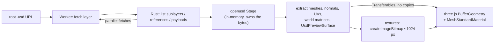

# usd-web-viewer

View OpenUSD files in the browser. Real USD composition (sublayers, references, payloads, variants) in a **593 KB** WASM module, rendered with three.js. MIT, no `SharedArrayBuffer`, no COOP/COEP headers, loads straight from Hugging Face Hub URLs.

| LG laptop | Robotiq gripper | Standard Bots arm | NVIDIA IV pole | NVIDIA chair | imagine.io railing |
|:-:|:-:|:-:|:-:|:-:|:-:|
|  |  |  |  |  |  |

## Quick start

```sh
npm install usd-web-viewer three   # not published to npm yet
```

Drop-in element (works as is in Vite and other bundlers; see [`examples/vite`](examples/vite)):

```html
<script type="module">import 'usd-web-viewer/element';</script>
<style>usd-viewer:not(:defined) { display: block; min-height: 200px }</style>

<usd-viewer
  src="https://huggingface.co/datasets/Robotiq-Official/simready-assets/resolve/main/Robotiq_2F_85/simready_usd/Robotiq_2F_85.usda"
  alt="Robotiq 2F-85 gripper"></usd-viewer>
```

| Attribute (property) | | Event | |
|---|---|---|---|
| `src` | root layer URL; changing it reloads, empty clears | `progress` | `detail`: `LoadProgress` |
| `textures` | `none`, `preview` (default) or `full` | `load` | `detail`: `LoadInfo`; the full result is `el.result` |
| `max-texture-size` (`maxTextureSize`) | long-side cap, default 1024 | `error` | an `ErrorEvent`; `.error` is a `UsdLoadError` |
| `alt` | accessible description (`role="img"`, `aria-label`) | | |
| `touch-action` (`touchAction`) | applied to the canvas, default `pan-y` so the page scrolls on touch screens | | |

The element sizes itself to its box, is transparent (style its background), aborts an in-flight load when `src` changes, survives being moved in the DOM, and frees the renderer, GPU context and WASM worker when removed. `el.viewer` exposes the underlying viewer. Importing it on a server (no DOM) is safe.

Or drive it from JavaScript:

```js
import { createViewer } from 'usd-web-viewer';
import { hubUrl } from 'usd-web-viewer/hub';

const viewer = createViewer(document.getElementById('app')); // throws UsdLoadError('webgl') without WebGL
const { info, complete } = await viewer.load(
  hubUrl('Robotiq-Official/simready-assets', 'Robotiq_2F_85/simready_usd/Robotiq_2F_85.usda', { revision: '<commit sha>' }),
  { onProgress: (p) => console.log(p.stage, p) },
);
console.log(info.meshes, info.triangles, info.warnings); // geometry is on screen now
console.log(await complete);                             // { textures, failed } once textures streamed in
```

A newer `viewer.load()` aborts the one in flight (its promise rejects with code `aborted`); `viewer.frame(object?)` re-frames the camera, `viewer.clear()` removes the stage and `viewer.dispose()` frees everything. `createViewer(target, { background })` sets an opaque background; the canvas is transparent by default.

Bring your own three.js scene instead:

```js
import { loadUsd } from 'usd-web-viewer';

const { root, info, complete, dispose } = await loadUsd(url, { textures: 'none' });
scene.add(root);   // THREE.Group, Y-up, metres
// later: dispose() frees geometries, materials and textures and stops streaming
```

| Option (`load` / `loadUsd`) | Default | |
|---|---|---|
| `textures` | `'preview'` | `'none'`; `'preview'`: base color up to `maxTextureSize`, roughness / metallic / occlusion (and opacity / emissive) maps up to 512 px, no normal maps; `'full'`: every map, normals included, up to `maxTextureSize`. See [preview vs full](bench/results/README.md#texture-modes-preview-vs-full) |
| `maxTextureSize` | `1024` | Long-side cap; textures are decoded straight to this size in the worker |
| `signal` | – | `AbortSignal`: cancels fetches, terminates the worker, rejects with a `UsdLoadError` of code `aborted` |
| `onProgress` | – | `{ stage: 'layers', loaded, total, bytes }`, `{ stage: 'compose', round }`, `{ stage: 'textures', loaded, total, bytes }` |
| `headers` | – | Sent with every layer and texture request (see [Embedding elsewhere](#embedding-elsewhere)) |
| `fetch` | – | Your own `fetch(url, { headers, signal })`, used for every request (proxied from the worker) |
| `wasmUrl` / `workerUrl` | bundled | Serve the `.wasm` / worker script from your own CDN |
| `maxConcurrentFetches` | `16` | Requests in flight at once (textures: at most 4 fetched and decoded at once) |
| `maxLayerBytes` | 1 GiB | Total size of USD layers to fetch before failing with a `fetch` error |

Errors are `UsdLoadError`s with a `code` (`aborted`, `fetch`, `compose`, `worker`, `webgl`), the failing `url` and, for a root layer that could not be fetched, the HTTP `status` (401 / 403 for a gated or private repo, 404 when missing). A missing sublayer, reference or payload is not an error: it is left out with a warning. `complete` rejects too if the load is aborted or disposed, or the worker dies after the geometry arrived.

`info.warnings` lists `{ code, message, path? }` for what could not be shown faithfully: `layer-missing`, `layer-unreadable`, `prim-unsupported` (e.g. `BasisCurves`, implicit `Sphere` / `Cube`), `material-fallback` (MDL other than OmniPBR/glTF, MaterialX), `texture-failed` and `composition`. It grows until `complete` settles. TypeScript declarations ship with the package.

### On the Hub

Hub `resolve` URLs work as they are, with no token: on huggingface.co the page's own cookies authorize gated and private repos the user can see. `hubUrl(repo, path, { revision, repoType })` from `usd-web-viewer/hub` builds them; pass a commit sha as `revision` rather than `main` so every layer of a multi-layer stage comes from the same commit.

### Embedding elsewhere

On another origin there are no Hub cookies: pass `headers: { Authorization: 'Bearer <token>' }` for gated or private repos, or your own `fetch` (e.g. one that goes through your backend). Both apply to every layer and texture request.

## Compared with other browser USD viewers

Six real [SimReady](https://huggingface.co/datasets/cfahlgren1/simready-usd-web-viewers) packages from the Hub.

| | **usd-web-viewer** | [Needle](https://www.npmjs.com/package/@needle-tools/usd) | [three.js `USDLoader`](https://github.com/mrdoob/three.js/tree/r186/examples/jsm/loaders/usd) | [tinyusdz](https://github.com/lighttransport/tinyusdz) | GLB (pre-converted) |
|---|---|---|---|---|---|
| Renders the 6 packages | **6/6** | 5/6 | 1/6 | 2/6 | 6/6 |
| WASM download (brotli) | **593 KB** | 6.0 MB | – | 1.4 MB | – |
| Peak tab memory | **170–623 MB** | 1.1–4.9 GB | 280 MB¹ | 290–450 MB¹ | 117–213 MB |
| WASM heap | **2–86 MB** | ~700 MB | – | 18–64 MB | – |
| IV pole fully loaded | **0.7 s**² | 11.8 s | ✗ | ✗ | 0.1 s |
| Needs COOP/COEP | **no** | yes | no | no | no |
| License | **MIT** | PolyForm Noncommercial | MIT | Apache-2.0 / MIT | – |

¹ only on the assets it renders. ² default `textures: 'preview'`: color plus packed occlusion/roughness/metallic maps (144 MB of 4K PNGs, data maps decoded at 512 px); `'full'` adds normal maps: 0.9 s, 218 MB, the set Needle loads. Headless Chromium, software rendering, localhost, median of 3 cold runs. Full tables and screenshots: [`bench/results`](bench/results/README.md).

## Matches Pixar OpenUSD

A Pixar `usd-core` oracle and our WASM build dump the same JSON per package (meshes, triangles, world bounding boxes, material bindings, UsdPreviewSurface inputs, and every textured input's file, channel, scale/bias, color space and UV set), then get diffed.

| Set | Match |
|---|---|
| 6 benchmark assets | **6/6** |
| usd-wg/assets material scenes | **10/10** |
| Random Hub sample (nvidia, LG, Robotiq, Standard Bots, agibot, imagine.io) | **186/187** |

The one miss is a 1.2e-5 unit offset on four lid meshes. Details: [`conformance/results`](conformance/results/README.md).

## How it works



Geometry shows first and textures stream in after. The worker is then terminated, which frees all WASM memory.

## Supported

| ✅ | ⚠️ not yet |
|---|---|
| `.usd` / `.usda` / `.usdc` / `.usdz` | `black` wrap mode (clamped), `.hdr` / EXR textures |
| Sublayers, references, payloads, variants, instancing | `opacityMode`, color spaces other than raw / sRGB / auto |
| UsdPreviewSurface with textured diffuse, emissive, roughness, metallic, occlusion, opacity and normal inputs (any channel, `scale` / `bias`, `fallback`, `sourceColorSpace`) | Vertex-varying `displayColor` on `GeomSubset` materials |
| `opacityThreshold` cutouts, texture alpha, `UsdTransform2d`, wrap modes, per-texture UV sets | MaterialX (grey fallback) |
| `displayColor` (constant or per vertex / face), `UsdPrimvarReader` diffuse | Skinning, animation, subdivision |
| MDL `OmniPBR` / glTF `pbr.mdl` parameters, grey fallback | |
| Visibility, purpose, `GeomSubset` materials | |

<details><summary>Build, test and benchmark</summary>

```sh
npm install
cargo install wasm-bindgen-cli --version 0.2.129   # once
npm run build:wasm      # cargo -> wasm-bindgen -> wasm-opt -Os
npm run serve           # http://127.0.0.1:8811/examples/index.html?url=<root .usd URL>
node scripts/node-test.mjs                          # compose + extract in Node
node scripts/api-test.mjs                           # progress, abort, headers, fetch, warnings, <usd-viewer>
(cd examples/vite && npm install && node test.mjs)  # Vite production build loading a Hub URL
node bench/run.mjs --configs usd-wasm,gltf --runs 3
node conformance/run.mjs --bench
node conformance/run.mjs --usdwg                   # usd-wg/assets material scenes vs Pixar
node conformance/browser-checks.mjs                # rendered fixtures (e.g. UV set routing)
```

</details>

## Credits

Built on [`openusd`](https://github.com/mxpv/openusd) (MIT, Maksym Pavlenko) and [three.js](https://github.com/mrdoob/three.js) (MIT). MIT licensed.
