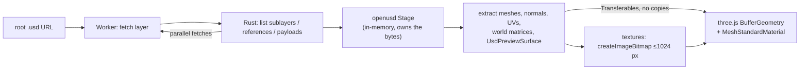

# usd-web-viewer

View OpenUSD files in the browser. Real USD composition (sublayers, references, payloads, variants) in a **601 KB** WASM module, rendered with three.js. MIT, no `SharedArrayBuffer`, no COOP/COEP headers, loads straight from Hugging Face Hub URLs.

| LG laptop | Robotiq gripper | Standard Bots arm | NVIDIA IV pole | NVIDIA chair | imagine.io railing |
|:-:|:-:|:-:|:-:|:-:|:-:|
|  |  |  |  |  |  |

## Quick start

```sh
npm install usd-web-viewer three   # not published to npm yet
```

Drop-in element (works as is in Vite and other bundlers; see [`examples/vite`](examples/vite)):

```html
<script type="module">import 'usd-web-viewer/element';</script>

<usd-viewer
  src="https://huggingface.co/datasets/Robotiq-Official/simready-assets/resolve/main/Robotiq_2F_85/simready_usd/Robotiq_2F_85.usda"
  poster="robotiq.png"
  alt="Robotiq 2F-85 gripper"></usd-viewer>
```

Attributes: `src`, `textures`, `max-texture-size`, `alt`, `loading` (`lazy` by default), `poster`, `reveal`. Events: `progress`, `load`, `error`, `context-lost`. `el.toBlob()` captures a PNG or WebP of the current view.

Or drive it from JavaScript:

```js
import { createViewer } from 'usd-web-viewer';

const viewer = createViewer(document.getElementById('app'));
const { info, complete } = await viewer.load(url);
console.log(info.meshes, info.triangles); // geometry is on screen now
await complete;                           // textures streamed in
```

Bring your own three.js scene instead:

```js
import { loadUsd } from 'usd-web-viewer';

const { root, dispose } = await loadUsd(url);
scene.add(root);   // THREE.Group, Y-up, metres
```

| Option | Default | |
|---|---|---|
| `textures` | `'preview'` | `'none'`, `'preview'` (no normal maps, data maps at 512 px) or `'full'`. |
| `maxTextureSize` | `1024` | Long-side cap for textures |
| `signal` | – | `AbortSignal` to cancel the load |
| `onProgress` | – | Called per stage: `layers`, `compose`, `geometry`, `textures` |
| `headers` / `fetch` | – | Auth for gated or private files outside huggingface.co |
| `allowedOrigins` | root's origin (+ Hub hosts) | Other origins layers and textures may come from; `['*']` for any |

Errors are `UsdLoadError`s with a `code`; anything that could not be shown faithfully is listed in `info.warnings`. Every option, error code and warning is typed in [`index.d.ts`](packages/viewer/src/index.d.ts).

## Compared with other browser USD viewers

Fourteen public files from the Hub in one run: eight single-file assets (36 to 3.5M triangles, 0.1 to 250 MB) and six multi-file [SimReady](https://huggingface.co/datasets/cfahlgren1/simready-usd-web-viewers) packages.

| | **usd-web-viewer** | [Needle](https://www.npmjs.com/package/@needle-tools/usd) | [openusd-wasm](https://www.npmjs.com/package/@openusd-wasm/three-loader) | [tinyusdz](https://github.com/lighttransport/tinyusdz) | [three.js `USDLoader`](https://github.com/mrdoob/three.js/tree/r186/examples/jsm/loaders/usd) | [cinevva](https://github.com/cinevva-engine/usdjs) |
|---|---|---|---|---|---|---|
| Renders correctly (single-file / SimReady) | **8/8 · 6/6** | 2/8 · 3/6 | 4/8 · 4/6 | 3/8 · 2/6 | 3/8 · 1/6 | 4/8 · 1/6 |
| Download (brotli) | **606 KB** | 4.9 MB | 1.8 MB | 1.2 MB | 20 KB | 82 KB |
| Time to fully loaded¹ | **1×** | 6.0× | 4.2× | 9.1× | 4.7× | 17.5× |
| Peak tab memory¹ | **1×** | 5.6× | 5.2× | 1.5× | 0.8× | 0.9× |
| WASM heap | **2 MB** minimum | ~690 MB | ~680 MB | 17 MB | – | – |
| Needs COOP/COEP | **no** | yes | yes | no | no | no |
| License | **MIT** | PolyForm Noncommercial | MIT² | Apache-2.0 / MIT | MIT | MIT |

| usd-web-viewer | Needle | openusd-wasm | tinyusdz | three.js | cinevva | GLB (offline) |
|:-:|:-:|:-:|:-:|:-:|:-:|:-:|
|  |  |  |  |  |  |  |

¹ geometric mean of library ÷ ours over the files both render correctly; below 1× is better than ours. three.js wins on small untextured single files: it parses on the main thread with no worker or WASM start-up. A GLB converted offline loads in about a third of our time. ² wraps Pixar OpenUSD; source repository not public. Headless Chromium, software rendering, localhost, median of 3 cold runs, default `textures: 'preview'`. Full tables, renders and file licenses live in the private benchmark repo, [`cfahlgren1/usd-web-viewer-bench`](https://github.com/cfahlgren1/usd-web-viewer-bench).

## Matches Pixar OpenUSD

A Pixar `usd-core` oracle and our WASM build dump the same JSON per package (meshes, triangles, world bounding boxes, material bindings, UsdPreviewSurface inputs, and every textured input's file, channel, scale/bias, color space and UV set), then get diffed.

| Set | Match |
|---|---|
| Every package in [nvidia/simready-assets](https://huggingface.co/datasets/nvidia/simready-assets) | **2,503/2,503** |
| 6 benchmark assets | **6/6** |
| usd-wg/assets material scenes | **10/10** |
| Edge-case fixtures (instancers, colors, UV sets, missing files, implicit shapes) | **11/11** |
| Random Hub sample (nvidia, LG, Robotiq, Standard Bots, agibot, imagine.io) | **186/187** |

The one miss is a 1.2e-5 unit offset on four lid meshes. The comparison harness lives in [`cfahlgren1/usd-web-viewer-bench`](https://github.com/cfahlgren1/usd-web-viewer-bench).

## How it works



Geometry shows first and textures stream in after. The worker is then terminated, which frees all WASM memory.

## Supported

Browsers: Chrome / Edge 111+, Safari 16.4+, Firefox 115+.

| ✅ | ⚠️ not yet |
|---|---|
| `.usd` / `.usda` / `.usdc` / `.usdz` | `black` wrap mode (clamped), `.hdr` / EXR textures |
| Sublayers, references, payloads, variants, instancing | `opacityMode`, color spaces other than raw / sRGB / auto |
| UsdPreviewSurface with textured diffuse, emissive, roughness, metallic, occlusion, opacity and normal inputs (any channel, `scale` / `bias`, `fallback`, `sourceColorSpace`) | Vertex-varying `displayColor` on `GeomSubset` materials |
| `opacityThreshold` cutouts, texture alpha, `UsdTransform2d`, wrap modes, per-texture UV sets | MaterialX (grey fallback) |
| `displayColor` (constant or per vertex / face), `UsdPrimvarReader` diffuse | Skinning, animation, subdivision |
| MDL `OmniPBR` / glTF `pbr.mdl` parameters, grey fallback | UDIM sets beyond the first tile (`<UDIM>` loads tile 1001 only) |
| Visibility, purpose, `GeomSubset` materials | Lights, cameras (fixed studio lighting) |
| `Cube`, `Sphere`, `Cylinder`, `Cone`, `Capsule`, `Plane` | Curves, points, volumes, Gaussian splats (listed in `info.warnings`) |

<details><summary>Build and test</summary>

```sh
npm install
cargo install wasm-bindgen-cli --version 0.2.129   # once
npm run build:wasm      # cargo -> wasm-bindgen -> wasm-opt -Os
npm run serve           # http://127.0.0.1:8811/examples/index.html?url=<root .usd URL>
npm test                                            # unit tests (Node, real WASM)
cargo test
node scripts/api-test.mjs                           # browser API tests; needs npm run serve
(cd examples/vite && npm install && node test.mjs)  # Vite production build loading a Hub URL
```

Benchmarks, the Pixar comparison and the Space demo live in [`cfahlgren1/usd-web-viewer-bench`](https://github.com/cfahlgren1/usd-web-viewer-bench).

</details>

## Security

Files are treated as untrusted: parsing is memory-safe Rust in a worker, every request goes through one policy (cookies only for the root file's repo), and every load is capped. See [`SECURITY.md`](SECURITY.md).

## Credits

Built on [`openusd`](https://github.com/mxpv/openusd) (MIT, Maksym Pavlenko) and [three.js](https://github.com/mrdoob/three.js) (MIT). MIT licensed.
