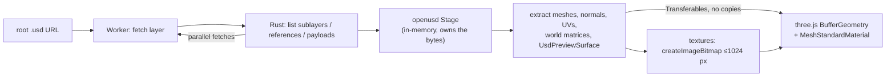

# usd-web-viewer

View OpenUSD files in the browser. Real USD composition (sublayers, references, payloads, variants) in a **527 KB** WASM module, rendered with three.js. MIT, no `SharedArrayBuffer`, no COOP/COEP headers, loads straight from Hugging Face Hub URLs.

| LG laptop | Robotiq gripper | Standard Bots arm | NVIDIA IV pole | NVIDIA chair | imagine.io railing |
|:-:|:-:|:-:|:-:|:-:|:-:|
|  |  |  |  |  |  |

## Quick start

```sh
npm install usd-web-viewer three   # not published to npm yet
```

```js
import { createViewer } from 'usd-web-viewer';

const viewer = await createViewer(document.getElementById('app'));
const { info, textures } = await viewer.load(
  'https://huggingface.co/datasets/Robotiq-Official/simready-assets/resolve/main/Robotiq_2F_85/simready_usd/Robotiq_2F_85.usda',
);

console.log(info.meshes, info.triangles); // geometry is on screen now
await textures;                           // base-color textures streamed in
```

Bring your own three.js scene instead:

```js
import { loadUsd } from 'usd-web-viewer';

const { root, info, textures, dispose } = await loadUsd(url, { maxTextureSize: 512 });
scene.add(root);   // THREE.Group, Y-up, metres
// later: dispose() frees geometries, materials and textures
```

| Option | Default | |
|---|---|---|
| `maxTextureSize` | `1024` | Long-side cap; textures are decoded straight to this size in the worker |
| `normalMaps` | `false` | Also fetch and apply normal maps |
| `prefetchVariants` | `false` | Fetch layers inside variants the layer doesn't select |
| `maxConcurrentFetches` | `16` | Requests in flight at once |
| `maxLayerBytes` | 1 GiB | Total size of USD layers to fetch before failing with a `resource limit exceeded` error |
| `onTexture` | – | Called after each texture is applied |
| `wasmUrl` | bundled | Serve the `.wasm` from your own CDN |

## Compared with other browser USD viewers

Six real [SimReady](https://huggingface.co/datasets/cfahlgren1/simready-usd-web-viewers) packages from the Hub.

| | **usd-web-viewer** | [Needle](https://www.npmjs.com/package/@needle-tools/usd) | [three.js `USDLoader`](https://github.com/mrdoob/three.js/tree/r186/examples/jsm/loaders/usd) | [tinyusdz](https://github.com/lighttransport/tinyusdz) | GLB (pre-converted) |
|---|---|---|---|---|---|
| Renders the 6 packages | **6/6** | 5/6 | 1/6 | 2/6 | 6/6 |
| WASM download (brotli) | **527 KB** | 6.0 MB | – | 1.4 MB | – |
| Peak tab memory | **167–418 MB** | 1.1–4.9 GB | 280 MB¹ | 290–450 MB¹ | 117–213 MB |
| WASM heap | **2–88 MB** | ~700 MB | – | 18–64 MB | – |
| IV pole fully loaded | **0.6 s** | 11.8 s | ✗ | ✗ | 0.1 s |
| Needs COOP/COEP | **no** | yes | no | no | no |
| License | **MIT** | PolyForm Noncommercial | MIT | Apache-2.0 / MIT | – |

¹ only on the assets it renders. Headless Chromium, software rendering, localhost, median of 3 cold runs. Full tables and screenshots: [`bench/results`](bench/results/README.md).

## Matches Pixar OpenUSD

A Pixar `usd-core` oracle and our WASM build dump the same JSON per package (meshes, triangles, world bounding boxes, material bindings, UsdPreviewSurface inputs, texture paths), then get diffed.

| Set | Match |
|---|---|
| 6 benchmark assets | **6/6** |
| Random Hub sample (nvidia, LG, Robotiq, Standard Bots, agibot, imagine.io) | **186/187** |

The one miss is a 1.2e-5 unit offset on four lid meshes. Details: [`conformance/results`](conformance/results/README.md).

## How it works



Geometry shows first and textures stream in after. The worker is then terminated, which frees all WASM memory.

## Supported

| ✅ | ⚠️ not yet |
|---|---|
| `.usd` / `.usda` / `.usdc` / `.usdz` | Normal map `scale` / `bias` |
| Sublayers, references, payloads, variants, instancing | Roughness / metallic / occlusion textures |
| UsdPreviewSurface, `UsdUVTexture`, `UsdTransform2d` | Alpha cutouts, `sourceColorSpace`, EXR |
| MDL `OmniPBR` / glTF `pbr.mdl` parameters, grey fallback | MaterialX (grey fallback) |
| Visibility, purpose, `GeomSubset` materials | Skinning, animation, subdivision |

<details><summary>Build, test and benchmark</summary>

```sh
npm install
cargo install wasm-bindgen-cli --version 0.2.129   # once
npm run build:wasm      # cargo -> wasm-bindgen -> wasm-opt -Oz
npm run serve           # http://127.0.0.1:8811/examples/index.html?url=<root .usd URL>
node scripts/node-test.mjs                          # compose + extract in Node
node bench/run.mjs --configs usd-wasm,gltf --runs 3
node conformance/run.mjs --bench
```

</details>

## Credits

Built on [`openusd`](https://github.com/mxpv/openusd) (MIT, Maksym Pavlenko) and [three.js](https://github.com/mrdoob/three.js) (MIT). MIT licensed.
